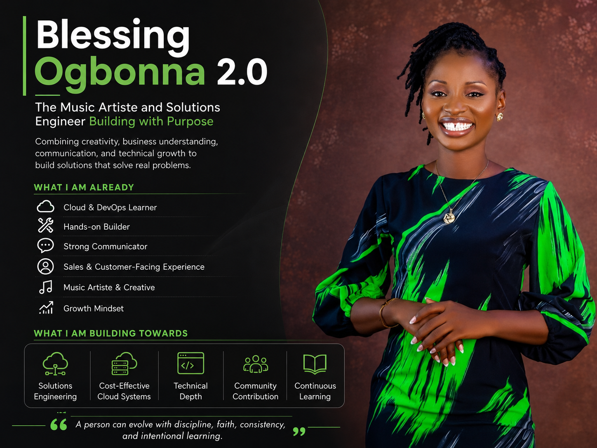
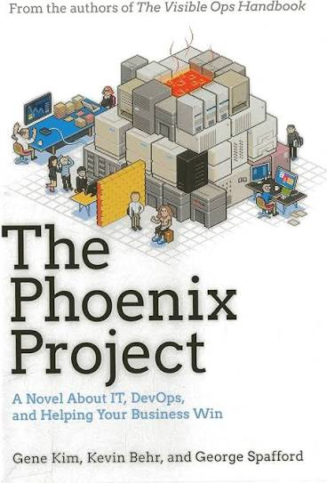

# Week 01 — Success Mindset (Mindset OS)

Part of the DevOps Micro Internship (DMI) Cohort 3 with Agentic AI

---

## Purpose (Read This First)

This week is not motivation homework.

This is you building your **Mindset OS** — the system you will use for the next 5 months (and honestly, for years).

### Expectations

* Be honest.
* Be specific.
* Be practical.
* Write like an adult professional: clear sentences, no one-liners.

You will reuse this in later weeks. So do it properly once.

---

# Assignment 1. What is something you believe to be true that most people around you would disagree with?

### Rules

* No "safe" answers.
* Must be your real belief (not copied from internet).
* Minimum 50 words.

**Hint:** What do you believe about career, money, learning, discipline, relationships, health, success, life, tech industry, etc. that most people don't agree with?

## Answer

One thing I believe that most people around me may disagree with is that choosing peace does not mean weakness. Many people think peaceful people are easily taken for granted, but I believe peace is strength. Sometimes, walking away, setting boundaries, and avoiding unnecessary drama protects my own peace.

---

# Assignment 2. What are the top 3 objective truths you discovered through experimentation and results?

### Definition

Objective truths do not depend on opinions. They hold true regardless of how people feel.

Write each truth in this format:

**Truth:** (1 sentence)

**Evidence from my life:** (2–4 lines: what you tried + what happened)

---

## Truth #1

### Truth

Sometimes, honest conflict has to happen before real peace can exist.

### Evidence from my life

I used to believe that keeping quiet all the time would always create peace. I had a friend who did some things I did not like, but I kept quiet most times because I wanted peace. One day, I finally stood up for myself, and we had a serious quarrel. Surprisingly, that confrontation brought more peace because we understood each other better and knew our boundaries after that.

---

## Truth #2

### Truth

Consistency produces results.

### Evidence from my life

I am also into music, and there was a time I decided to post my music videos consistently on social media about three times a week for almost three months. During that period, I started getting more engagement and visibility. When I stopped posting consistently, I noticed that my engagement dropped. That taught me that consistency truly matters.

---

## Truth #3

### Truth

Being strategic produces better results than trying to be everywhere.

### Evidence from my life

When I worked as a Sales Manager, I was brought in to replace two people who were underperforming. Instead of doing things the usual way, I decided to be more intentional and strategic about my sales approach. I focused on the right prospects, planned my follow-ups better, and paid attention to what was actually working. With that approach, I was able to exceed the sales targets allocated for each quarter of the year.

---

# Assignment 3. What does your 2.0 version look like?

### Instructions

Write as if a journalist is writing about you **3 to 7 years from now** (not 20 years).

**Minimum 300 words.**

### Rules

* Write in past tense, like it already happened.
* Don't use "likes to / wants to / hopes to."
* Use specifics:

  * built
  * shipped
  * led
  * published
  * earned
  * relocated
  * contributed
* Include skills proof:

  * projects
  * portfolios
  * GitHub
  * blogs
  * certifications
  * job role
  * leadership
  * community contribution
* Add 1–3 images if you can (optional but powerful).

### Publish It Publicly On Any ONE

* LinkedIn
* Medium
* WordPress
* Blogspot
* Personal blog
* Portfolio page

Include this line:

> **P.S. This post is part of the DevOps Micro Internship (DMI) with Agentic AI — Cohort 3 — by [Pravin Mishra](https://www.linkedin.com/in/pravin-mishra-aws-trainer/). My graded progress is public: https://dmi.pravinmishra.com/s/YOUR-GITHUB-USERNAME.html · Start your DevOps journey: https://dmi.pravinmishra.com/?utm_source=student&utm_medium=ps-blog&utm_campaign=cohort3**

## Your Article
 
Blessing Ogbonna 2.0: The Music Artiste and Solutions Engineer Building with Purpose

Three to seven years from now, Blessing Ogbonna had grown into a professional who combined creativity, business understanding, and technical depth in a unique way. She was known as a Music Artiste and Solutions Engineer who did not only build systems, but also understood people, business needs, and the importance of cost-effective technology decisions.

Her journey into Cloud and DevOps started with curiosity, consistency, and a strong desire to understand how modern systems worked behind the scenes. Over time, she built and documented several hands-on projects across cloud computing, DevOps, automation, CI/CD, containers, monitoring, and infrastructure. Her GitHub became a strong proof of her growth, showing projects that were not just deployed, but properly documented for others to understand and learn from.

Blessing also earned relevant cloud and DevOps certifications and used her learning to solve real business problems. She worked on solutions that helped companies deploy applications more reliably, reduce unnecessary cloud costs, and improve the way their teams built and delivered software. One thing that stood out about her was her ability to explain technical concepts in simple language. Coming from a sales and customer-facing background, she understood that technology was not just about tools; it was also about communication, business value, and solving the right problem.

She became very interested in Solutions Architecture because she noticed that some engineers focused only on hosting applications without thinking deeply about cost, scalability, and the stage of the business. For example, she understood that not every startup MVP needed a complex Kubernetes setup from day one. Sometimes, the better solution was the one that was simple, cost-effective, secure, and easy to manage.

As she grew, Blessing published blogs, shared lessons from her DevOps journey, contributed to communities, and helped other beginners understand that growth in tech takes patience and structure. Her background in music also remained part of her identity, reminding people that creativity and engineering could work together.

Blessing Ogbonna 2.0 became proof that a person can evolve with discipline, faith, consistency, and intentional learning.

P.S. This post is a part of DevOps Micro Internship with Agentic AI Cohort-3 by Pravin Mishra. You can start your DevOps journey by joining this Discord community ( https://discord.pravinmishra.com/ ).

### Public Link

Paste your link here:

<<<<<<< HEAD:week-01-success-mindset/README.md
`____https://medium.com/@blessingogbonna2025/blessing-ogbonna-2-0-the-music-artiste-and-solutions-engineer-building-with-purpose-5ff8bbaf5164?sharedUserId=blessingogbonna2025______________________`
=======
`Add your URL here`
>>>>>>> upstream/main:week-01-success-mindset/assignment-01-mindset-os.md

---

# Assignment 4. Have you ever cut corners (unethical / dishonest / shortcut behavior — not necessarily illegal)? If yes, how did it make you feel?

### Important

You don't need to write the full story.

Focus on the feeling:

* guilt
* fear
* shame
* stress
* regret
* numbness
* etc.

This is about self-awareness, not judgment.

### Answer Format

**Yes / No**

If Yes:

**What emotion did you feel?** (minimum 50–100 words)

## Answer

Yes, I have cut corners before, and it made me feel bad because that is not the kind of person I want to be. At that moment, my human nature came to play, and I thought more about myself than the other person involved. Afterward, I felt guilty and selfish because I knew I could have handled the situation better. The good thing is that I became aware of it, resolved the issue, and apologized to the person involved. It taught me to be more intentional about doing things the right way.

---

# Assignment 5. What are 10 non-fiction books you plan to read in the next 1 year?

### Rules

* Mention **Title + Author**
* Any language allowed
* No fiction novels

### Tip

Choose books that improve:

* mindset
* communication
* productivity
* health
* money
* career
* leadership

## Book List

1. The Top Five Regrets of the Dying — Bronnie Ware
2. Becoming Her — Mimi Kalinda
3. What I Know For Sure — Oprah Winfrey
4. Who Moved My Cheese? — Spencer Johnson
5. The Phoenix Project — Gene Kim, Kevin Behr, and George Spafford

6. Power Thoughts — Joyce Meyer
7. The Unicorn Project — Gene Kim
8. Success Strategies — David Oyedepo
9. Atomic Habits — James Clear
10. Deep Work — Cal Newport

---

# Assignment 6. What are the things you will measure regularly in your life and career?

### Rules

List topics only. No need to share numbers.

### Must Include

* Learning / skill
* Output / proof
* Health / energy
* Time / focus
* Money / finance (personal or business)

### Example

* Learning hours per week
* Deep work sessions per week
* Projects shipped / documented
* Steps / workouts
* Sleep hours
* Spending tracker

## My Metrics

* DMI assignments submitted before deadline
* Projects built and documented
* Ability to explain technical concepts simply
* Consistency with LinkedIn and music content
* Sleep hours and energy level
* Leisure and family time
* Personal spending and savings habit
* Procrastination control and focus level
* Learning hours per week
* Deep work sessions completed

---

# Assignment 7. Brain Dump + 5-Month System Plan

## Step 1: Brain Dump (Private)

Do a brain dump of everything in your mind into a notebook.

Examples:

* Bills
* Tasks
* Worries
* Goals
* Pending messages
* Ideas
* Responsibilities

### Did You Do It?

**Yes / No**

Answer:

Yes

---

## Step 2: Your 5-Month Routine + Focus Blocks

Create a simple plan you can realistically follow for the next 5 months.

### Weekly Routine

Example:

* Mon–Thu: 60 min deep work
* Sat: DMI session
* Sun: Weekly review

#### My Weekly Routine

* Sunday: Review the past week, check what was completed, and prepare for the new week.
* Sunday evening: Start watching the new DMI videos and understand the assignment requirements.
* Monday–Thursday: Do at least 60 minutes of focused deep work daily.
* Wednesday: Aim to complete about 80–90% of the weekly assignment.
* Thursday–Friday: Submit the weekly assignment, review what I have done, and prepare for the next DMI session on Saturday.
* Saturday: Attend the DMI live session, rest afterward, and rewatch the class recording if needed.
* Daily: Learn one important concept, take simple notes, and avoid waiting until the deadline before starting.
---

### Focus Blocks

#### When Will You Do DMI Work? (Days + Time)

Because I work 9–5, I will start my DMI work from Saturday evening after the live session. I will use my weekend to understand the assignment, watch or rewatch the videos, and start early so I do not wait until the deadline. During the week, I will also allocate focused time after work to continue the assignment and improve my understanding.

#### How Many Sessions Per Week?

I will have at least 5–6 focused sessions per week. Outside weekends, I will give at least 45 minutes to 1 hour daily to my growth in DMI. On weekends, I will use more time because that is when I have better space to learn, practice, and document my work.

---

### Distraction Rules

Examples:

* Phone rules
* Social media rules
* Environment setup

#### My Distraction Rules

My first distraction rule is to discipline my thoughts while studying and bring my mind back whenever I notice I am lost in thought. I will also keep my phone far from me, especially since I use my SIM inside my laptop for internet connection. I will avoid opening social media until I finish the work I allocated to myself. When it is time for DMI, I will shift my mind fully to the task and focus until I am done.

---

# Reflection – Week 1

### Biggest insight I got about myself this week

The biggest insight I got about myself this week is that I can achieve great things beyond my expectation when I plan ahead and stay focused without distractions. For example, after attending church on Sunday, I came back in the afternoon and took a nap. When I woke up, I decided to give 45 minutes to 1 hour of focused time to DMI without distraction. I was surprised by how much I was able to achieve within that time. It showed me that focus and planning can produce better results than waiting for perfect conditions.

### My biggest weakness/loop I noticed

My biggest weakness is that I always want to do everything at the same time. I can be thinking about work, DMI, music, LinkedIn, volunteer opportunities, and other goals together, and this can make me feel overwhelmed. I noticed that when I try to carry everything at once, I may lose focus on the exact thing I am supposed to do at that moment.

### One system I will implement from this week (exact habit + time)

The system I will implement from this week is “one thing at a time.” When I am working, I will keep DMI aside and focus on work. When I pick DMI, I will keep every other thing aside and focus on the assignment or learning task for that period. My exact habit is to do 45 minutes to 1 hour of DMI deep work after work during the week, and also start my DMI assignment on Saturday evening after the live session.

### LinkedIn Post

Paste your LinkedIn post link here:

<<<<<<< HEAD:week-01-success-mindset/README.md
`__Blessing Ogbonna 2.0: Building with Purpose

Three to seven years from now, Blessing Ogbonna had grown into a professional known for combining technical skill, business understanding, communication, and creativity. She was not only recognized as a Cloud and DevOps professional, but also as a Solutions Engineer who understood how to build systems that solved real problems for businesses.

Her journey into technology started with curiosity and consistency. Over the years, she built and shipped several cloud and DevOps projects across AWS, Linux, Docker, Kubernetes, CI/CD, monitoring, infrastructure automation, and security. Her GitHub became a strong portfolio of documented projects, showing how she moved from learning concepts to applying them in real environments. She also published technical blogs where she explained cloud and DevOps concepts in simple language for beginners.

Blessing earned relevant cloud and DevOps certifications and used her knowledge to contribute to real business solutions. She worked on projects that helped companies deploy applications more reliably, improve automation, and reduce unnecessary cloud costs. One of the things that made her stand out was her ability to think beyond tools. She understood that engineering was not only about hosting applications, but also about choosing the right solution for the stage, budget, and goals of a business.

Coming from a sales and customer-facing background, Blessing brought strong communication and business awareness into her technical work. She could speak with technical teams and also explain solutions clearly to non-technical stakeholders. This helped her grow in the direction of Solutions Architecture, where she designed systems that were cost-effective, scalable, secure, and easy to manage.

She also contributed to communities by mentoring beginners, sharing her learning process publicly, and encouraging others who were transitioning into tech. 

Her background in music remained part of her identity, showing that creativity and engineering could work together. She became an example of someone who did not abandon one part of herself to build another.

Blessing Ogbonna 2.0 became proof that growth is possible through faith, discipline, consistency, and intentional learning. She built with purpose, communicated with clarity, and continued to evolve as technology changed.

P.S. This post is a part of DevOps Micro Internship with Agentic AI Cohort-3 by Pravin Mishra. You can start your DevOps journey by joining this Discord community ( https://lnkd.in/gRBQEwxE ).________________________`
=======
`Add your URL here`
>>>>>>> upstream/main:week-01-success-mindset/assignment-01-mindset-os.md

---

## 10. Proof of Work

- LinkedIn Post URL: **(https://www.linkedin.com/posts/blessing-ogbonna_blessing-ogbonna-20-building-with-purpose-share-7477679336108728320-Nx1_/?utm_source=share&utm_medium=member_desktop&rcm=ACoAADqul0oBNU_YyB5vIlKM3BG37iBvIrL_-oI)**  
- Blog / Medium : **(https://medium.com/@blessingogbonna2025/blessing-ogbonna-2-0-the-music-artiste-and-solutions-engineer-building-with-purpose-5ff8bbaf5164?sharedUserId=blessingogbonna2025)**  

---

## 📌 About DMI & CloudAdvisory

DevOps Micro Internship (DMI) is a project-based DevOps program run by Pravin Mishra (The CloudAdvisory) focused on real-world execution, systems thinking, and career readiness.

It helps learners build strong DevOps foundations with hands-on experience.

## 📌 Resources

- 🌐 **DMI Official Website:** https://pravinmishra.com/dmi  
- 🎓 **DevOps for Beginners (Udemy):** https://www.udemy.com/course/devops-for-beginners-docker-k8s-cloud-cicd-4-projects/  
- 🎓 **Ultimate Agentic AI DevOps with Clude Code** https://www.udemy.com/course/ultimate-agentic-ai-devops-with-claude-code/?referralCode=448389767BC96284087B
- 🎓 **DevOps with Claude Code: Terraform, EKS, ArgoCD & Helm** https://www.udemy.com/course/devops-with-claude-code-terraform-eks-argocd-helm/?referralCode=1C5B734505D65A010FA3
- ▶️ **YouTube Playlist (DMI Cohort 3):** https://www.youtube.com/playlist?list=PLFeSNDtI4Cho  
- 🔗 **Pravin Mishra (LinkedIn):** https://www.linkedin.com/in/pravin-mishra-aws-trainer/  
- 🏢 **CloudAdvisory (LinkedIn):** https://www.linkedin.com/company/thecloudadvisory/

---

*This submission is part of DevOps Micro Internship (DMI) Cohort 3 — Agentic AI Track*