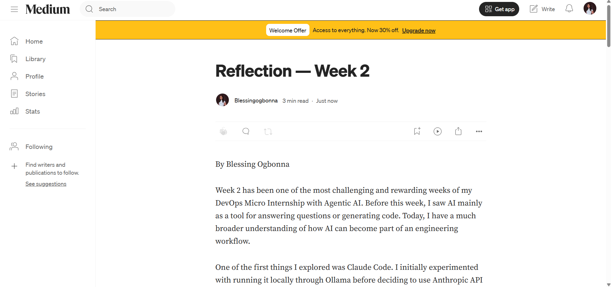
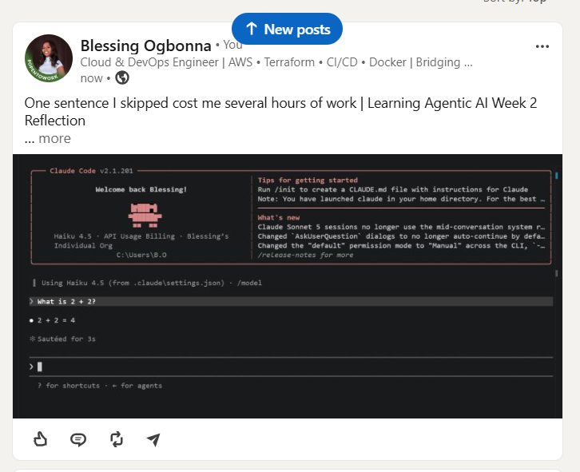

# Assignment 8 — Week 2 Reflection Blog

Part of the DevOps Micro Internship (DMI) Cohort 3 with Agentic AI

---

# Purpose

In this assignment, you will reflect on your Week 2 learning journey and write a short blog capturing your experience working with Agentic AI tools such as Claude Code, Skills, Subagents, MCP, Hooks, Permissions, and Memory.

You will also publish a LinkedIn post summarizing your learning and share both links for evaluation.

---

# Task 1 — Write Your Reflection Blog

## Goal

By Blessing Ogbonna

Week 2 has been one of the most challenging and rewarding weeks of my DevOps Micro Internship with Agentic AI. Before this week, I saw AI mainly as a tool for answering questions or generating code. Today, I have a much broader understanding of how AI can become part of an engineering workflow.

One of the first things I explored was Claude Code. I initially experimented with running it locally through Ollama before deciding to use Anthropic API credits with the Haiku model to complete my assignments more efficiently. That experience helped me understand the difference between running local models and using cloud-hosted AI services.

I also learned that AI becomes much more effective when it has context. Working with Memory showed me how project-specific information can be preserved, reducing the need to repeat the same instructions every session. Instead of treating AI like a chatbot, I began seeing it as a teammate that can be onboarded into a project.

Another important topic was Hooks. I learned that hooks can automate checks and actions before or after commands, making workflows more reliable and reducing repetitive manual tasks. While setting up hooks, I encountered a jq PATH issue that required troubleshooting. Solving that problem reminded me that successful engineering isn't only about writing code—it also requires understanding how development tools interact with the operating system.

This week also introduced me to Subagents. Rather than assigning every task to one AI assistant, I learned how specialized agents can focus on security reviews, cost optimization, or Terraform generation. Each agent is designed for a specific responsibility, making the workflow more organized and efficient.

Write on Medium
Closely related to this was learning about Permissions. I now understand why AI agents should only receive the permissions they need to perform their tasks. For example, a security auditor should review and report issues rather than modify infrastructure. This follows the principle of least privilege and helps reduce the risk of unintended changes.

Another concept I explored was the Model Context Protocol (MCP). It showed me how AI can securely interact with external tools and services, expanding what an AI assistant can do beyond simply answering questions.

Perhaps the biggest lesson of the week wasn’t technical.

While working through one of my assignments, I skipped a single instruction because I assumed I already understood the task. That one mistake cost me several hours of work. I had to delete files, retake screenshots, and repeat parts of the assignment. Although it was frustrating, it reminded me that engineering is as much about attention to detail as it is about technical knowledge.

By the end of the week, I noticed a significant increase in my confidence. Concepts like Claude Code, Hooks, Memory, Permissions, MCP, and Subagents felt unfamiliar at first, but after repeated practice, troubleshooting, and completing the assignments, they became much more comfortable to work with.

One habit I plan to implement going forward is to carefully read and understand project requirements before I begin implementation. I also want to continue documenting my learning publicly because writing about my experiences reinforces what I have learned and allows me to measure my growth over time.

Week 2 reminded me that modern DevOps is no longer only about cloud platforms, containers, and automation. Agentic AI is becoming part of the engineering workflow, and learning how to work effectively with AI is quickly becoming an important skill for every engineer. I am grateful for everything I learned this week and look forward to applying these lessons in future projects.

Agentic Ai Learning

### Blog Requirements

Your blog must include:

* Title: **Reflection – Week 2**
* Minimum 300 words
* At least 2–3 topics from Week 2 (Claude Code, Skills, Subagents, MCP, Hooks, Permissions, Memory)
* Honest personal reflection (learning, challenges, mindset)
* One habit/system you plan to implement
* Your full name clearly visible

### Allowed Platforms

You can publish your blog on:

* Hashnode
* Medium
* Dev.to
* LinkedIn Article
* GitHub Markdown file
* Substack

---

### Evidence

#### Screenshot 1 — Blog published and visible



---

### Submission Field

Blog Link:

`https://medium.com/@blessingogbonna2025/reflection-week-2-93907e004e0c?sharedUserId=blessingogbonna2025`

---

# Task 2 — Create LinkedIn Post

## Goal

Share your Week 2 learning publicly on LinkedIn.

---

### LinkedIn Post Requirements

Your post must include:

* One screenshot from any Week 2 assignment
* Short reflection (what you learned or built)
* Required P.S. line exactly as given below

---

### Required P.S. Line (Must Include Exactly)

P.S. This post is a part of DevOps Micro Internship with Agentic AI Cohort-3 by Pravin Mishra. You can start your DevOps journey by joining this Discord community ( [https://discord.pravinmishra.com/](https://discord.pravinmishra.com/) ).

---

### Suggested Hashtags

#DMIByPravinMishra #AgenticAI #ClaudeCode #DevOps #LearningInPublic

---

### Evidence

#### Screenshot 2 — LinkedIn post published



---

### Submission Field
```
One sentence I skipped cost me several hours of work | Learning Agentic AI Week 2 Reflection

This week reminded me that engineering isn't only about learning new tools.

While working through my DevOps Micro Internship with Agentic AI, I had the opportunity to explore concepts such as Claude Code, Hooks, Memory, Subagents, MCP, and Permissions. Every assignment introduced me to a new way of thinking about AI, not just as a chatbot, but as an engineering assistant that can be guided with context and clear instructions.

In my excitement, I skipped one sentence in the assignment instructions because I thought I already understood what needed to be done.

That one mistake cost me several hours of work.I had to go back, delete files, retake screenshots, update my repository, and redo part of the assignment from the correct point. It was frustrating at the time, but it turned out to be one of the biggest lessons I learned all week.

It reminded me that engineering isn't only about building. It's also about paying attention to details.

Whether it's a line in a document, a configuration file, or a command in the terminal, every instruction matters.

Beyond that lesson, I now have a much better understanding of how Agentic AI can fit into a DevOps workflow, and I'm excited to keep learning and building throughout this internship.

#DMIByPravinMishra #AgenticAI #ClaudeCode #DevOps #LearningInPublic

P.S. This post is a part of DevOps Micro Internship with Agentic AI Cohort-3 by Pravin Mishra. You can start your DevOps journey by joining this Discord community ( https://lnkd.in/gRBQEwxE ).
```

---

### LinkedIn Post Link:

`https://lnkd.in/p/ePteQwh8`

---

# Submission Instructions

* Blog must be publicly accessible
* LinkedIn post must be visible (public or unlisted where applicable)
* All required fields must be filled
* Screenshot proofs must be added to GitHub repository
* Do not include sensitive information in blog or post

---

# Completion Checklist

* [ ] Blog written with required structure
* [ ] Blog includes at least 2–3 Week 2 topics
* [ ] Blog is publicly accessible
* [ ] LinkedIn post created
* [ ] Required P.S. line included
* [ ] LinkedIn post content copied in submission field
* [ ] Blog link added
* [ ] LinkedIn post link added
* [ ] Screenshots added to GitHub repo

---

# About DMI & CloudAdvisory

DevOps Micro Internship (DMI) is a project-based DevOps program run by Pravin Mishra (The CloudAdvisory), focused on real-world execution, systems thinking, and agentic AI workflows.

It helps learners build strong DevOps foundations through hands-on experience.

---

# Resources

* 🌐 DMI Official Website: [https://pravinmishra.com/dmi](https://pravinmishra.com/dmi)
* 🎓 DevOps for Beginners (Udemy): [https://www.udemy.com/course/devops-for-beginners-docker-k8s-cloud-cicd-4-projects/](https://www.udemy.com/course/devops-for-beginners-docker-k8s-cloud-cicd-4-projects/)
* 🎓 Agentic AI DevOps with Claude Code: [https://www.udemy.com/course/ultimate-agentic-ai-devops-with-claude-code/](https://www.udemy.com/course/ultimate-agentic-ai-devops-with-claude-code/)
* 🎓 DevOps with Claude Code: Terraform, EKS, ArgoCD & Helm: [https://www.udemy.com/course/devops-with-claude-code-terraform-eks-argocd-helm/](https://www.udemy.com/course/devops-with-claude-code-terraform-eks-argocd-helm/)
* ▶️ YouTube Playlist: [https://www.youtube.com/playlist?list=PLFeSNDtI4Cho](https://www.youtube.com/playlist?list=PLFeSNDtI4Cho)
* 🔗 Pravin Mishra (LinkedIn): [https://www.linkedin.com/in/pravin-mishra-aws-trainer/](https://www.linkedin.com/in/pravin-mishra-aws-trainer/)
* 🏢 CloudAdvisory (LinkedIn): [https://www.linkedin.com/company/thecloudadvisory/](https://www.linkedin.com/company/thecloudadvisory/)

