# Assignment 5 — Bash Script Automation Drill (OPS Checklist)

Part of the DevOps Micro Internship (DMI) Cohort 3 with Agentic AI

---

## Purpose

In this assignment, you will practice Bash scripting by building a series of small automation scripts covering environment setup, variables, arrays, loops, file conditionals, if-else logic, and functions. These scripts form the foundation of real-world Linux automation used in DevOps, cloud, and production support environments.

---

# Task 1 — Bash Environment & Workspace Setup

## Goal

Verify that Bash is available on your system and create a clean workspace for this assignment.

### Evidence

#### Screenshot 1 — Output of `echo $SHELL` and `bash --version`

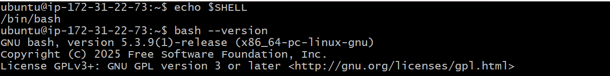

---

#### Screenshot 2 — Output of `pwd` and `ls -lah` showing the scripts directory

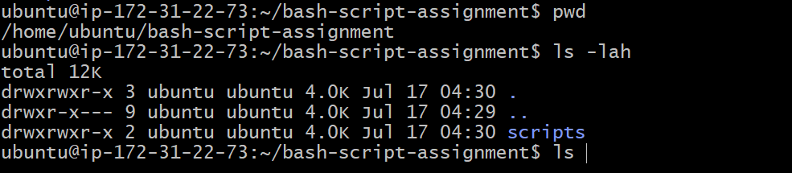

---

### Notes

Answer the following in your own words:

**1. What is Bash?**

Bash stands for Bourne Again Shell. It is a command-line shell and scripting language used mainly in Linux environments. It allows us to interact with the operating system by running commands directly and also helps us automate repetitive tasks by writing scripts.

---

**2. What is the difference between shell and Bash?**

A shell is a program that provides a way for users to communicate with the operating system through commands. Bash is one type of shell that is commonly used in Linux systems. Other examples of shells include sh, zsh, and fish, but Bash has its own syntax and scripting features.

---

**3. Why is it important to confirm the Bash version before writing scripts?**

It is important to confirm the bash cersion before writing scripts to ensure that the syntax and features of the current version alligns with our system.

---

# Task 2 — Your First Bash Script

## Goal

Create your first Bash script, make it executable, and run it from the terminal.

### Evidence

#### Screenshot 1 — Content of `first-script.sh`

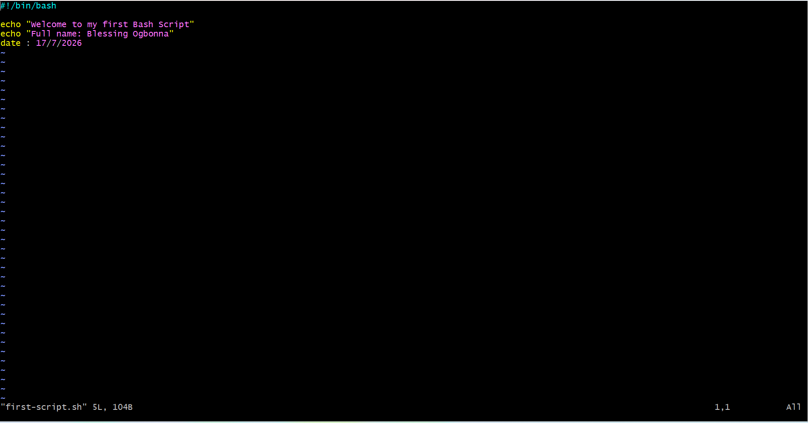

---

#### Screenshot 2 — Output of `./first-script.sh`

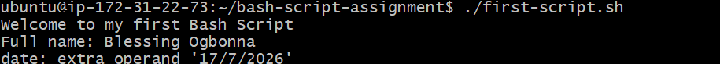

---

#### Screenshot 3 — Output of `ls -l first-script.sh` showing executable permission

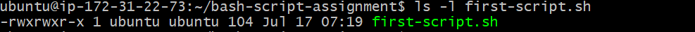

---

### Notes

Answer the following in your own words:

**1. What is the purpose of `#!/bin/bash`?**

#!/bin/bash is called the shebang line. It tells the operating system that the script should be executed using the Bash interpreter.

---

**2. Why do we use `chmod +x` before running a script?**

By default, a newly created script may not have permission to run as a program. chmod +x gives the script executable permission, allowing us to run it directly using ./script-name.sh.

---

**3. What is the difference between running a script using `./script.sh` and `bash script.sh`?**

When we run ./script.sh, we are executing the script directly, so it needs execute permission and uses the interpreter specified in the shebang line.

When we run bash script.sh, we are directly telling Bash to execute the script, so execute permission is not required.

---

# Task 3 — Variables: User Information Script

## Goal

Use variables to store and display user-related information.

### Evidence

#### Screenshot 1 — Content of `user-info.sh`

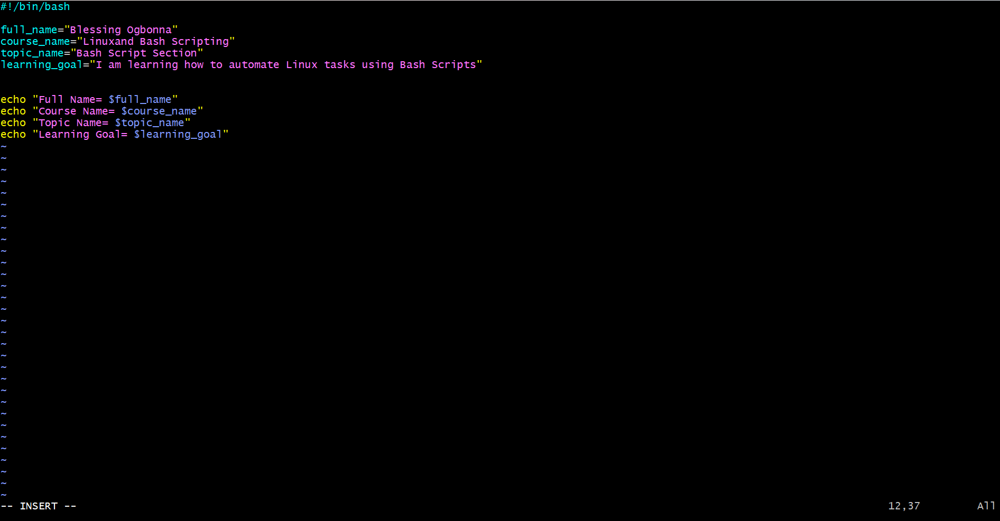

---

#### Screenshot 2 — Output of `./user-info.sh`

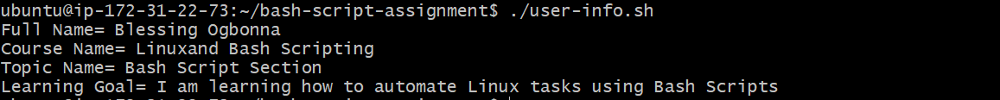

---

### Notes

Answer the following in your own words:

**1. What is a variable in Bash?**

A variable in Bash is a container used to store information that can be reused later in a script. For example, instead of repeatedly writing my name, I can store it in a variable and call it whenever needed.

---

**2. Why should we avoid spaces around the `=` sign when creating variables?**

Bash does not allow spaces around the = sign during variable assignment. If spaces are added, Bash interprets it as a command instead of storing a value.

---

**3. How do you access the value stored inside a Bash variable?**

We access a variable value by adding the $ symbol before the variable name.

---

# Task 4 — Arrays & Loops: Tools Checklist Script

## Goal

Use arrays and loops to print a checklist of tools used in Bash scripting.

### Evidence

#### Screenshot 1 — Content of `tools-checklist.sh`

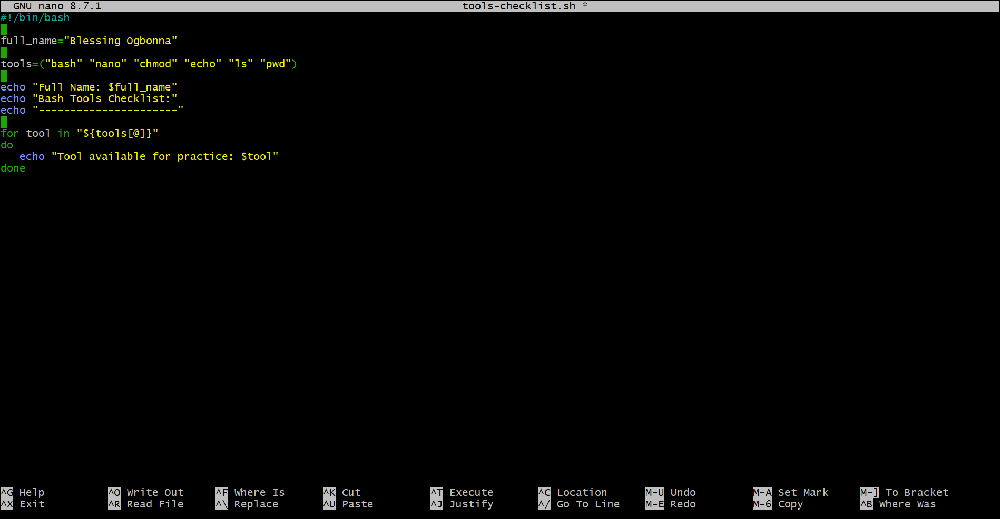

---

#### Screenshot 2 — Output of `./tools-checklist.sh`

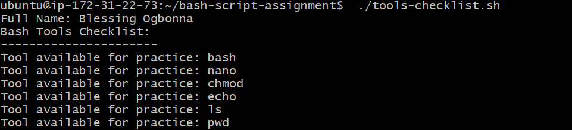

---

### Notes

Answer the following in your own words:

**1. What is an array in Bash?**

An array in Bash is a variable that can store multiple values under one name. Instead of creating separate variables for each tool, we can store all tools inside one array.

---

**2. Why are arrays useful in scripts?**

Arrays make scripts easier to organize because related values can be stored together and processed using loops. This reduces repeated code and makes scripts easier to maintain.

---

**3. What does `"${tools[@]}"` mean?**

"${tools[@]}" represents all the values stored inside the tools array. It allows the loop to access and process each item in the array individually.

---

**4. What is the purpose of the `for` loop in this script?**

The for loop is used to go through each item in the array one after another. In this script, it displays each tool stored inside the tools array.

---

# Task 5 — Loops: Number Counter Script

## Goal

Use loops to repeat a task multiple times.

### Evidence

#### Screenshot 1 — Content of `counter.sh`

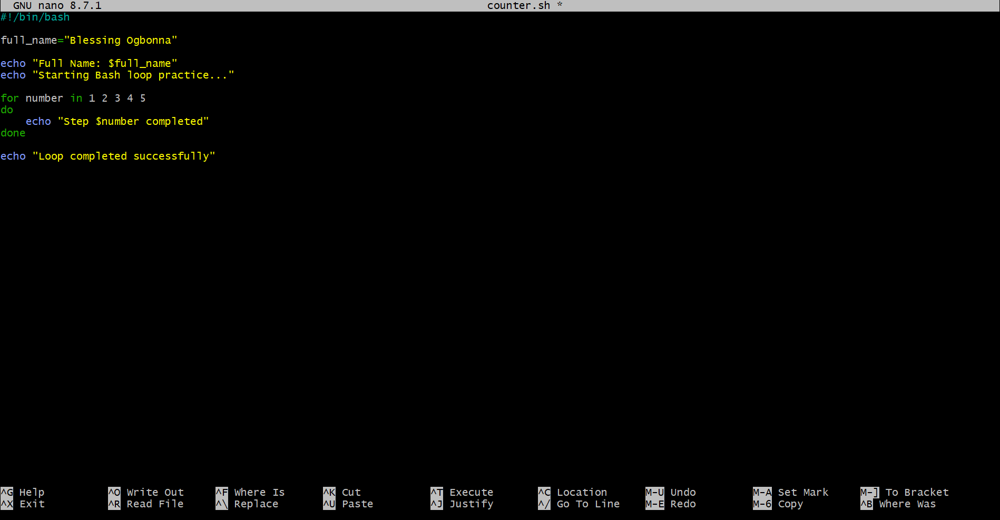

---

#### Screenshot 2 — Output of `./counter.sh`

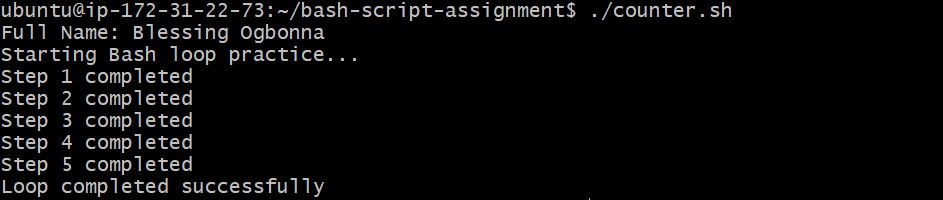

---

### Notes

Answer the following in your own words:

**1. What is a loop?**

A loop is a programming structure used to repeat a task multiple times without writing the same command repeatedly.

---

**2. Why do we use loops in Bash scripting?**

Loops help automate repetitive tasks. They make scripts shorter, faster, and easier to manage.

---

**3. How many times did the loop run in your script?**

The loop ran five times because it processed the five values: 1 2 3 4 5

---

**4. What would you change if you wanted the loop to run 10 times?**

I would add more values to the loop: for number in 1 2 3 4 5 6 7 8 9 10

---

# Task 6 — Files & Conditionals: File Validation Script

## Goal

Use file checks and conditionals to verify whether files and directories exist.

### Evidence

#### Screenshot 1 — Output of `ls -lah ../test-folder`

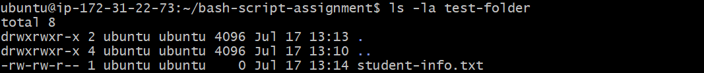

---

#### Screenshot 2 — Content of `file-check.sh`

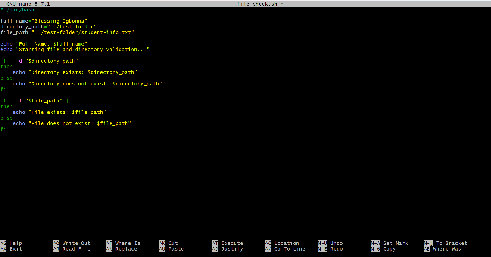

---

#### Screenshot 3 — Output of `./file-check.sh`

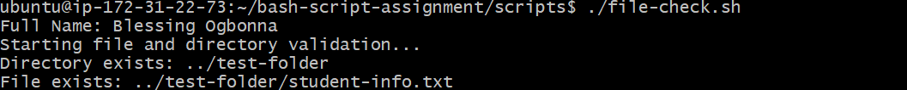

---

### Notes

Answer the following in your own words:

**1. What does `-d` check in Bash?**

-d checks whether a given path exists and whether it is a directory.

---

**2. What does `-f` check in Bash?**

-f checks whether a given path exists and whether it is a regular file.

---

**3. Why should file and directory paths be stored in variables?**

Storing paths in variables makes scripts easier to read and update. If the path changes, we only need to update the variable instead of changing it in multiple places.

---

**4. What happens if the file does not exist?**

If the file does not exist, the condition becomes false and the script executes the else section, showing that the file was not found.

---

# Task 7 — Conditionals: Pass or Retry Script

## Goal

Use if-else conditionals to make decisions based on a variable value.

### Evidence

#### Screenshot 1 — Content of `score-check.sh` with `score=85`

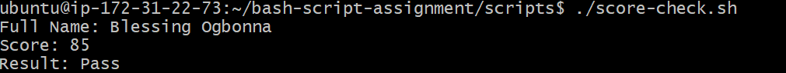

---

#### Screenshot 2 — Output showing `Result: Pass`

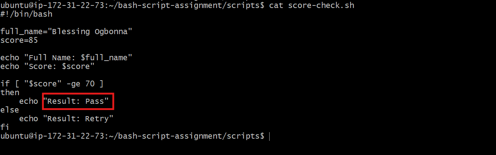

---

#### Screenshot 3 — Content of `score-check.sh` with `score=55`

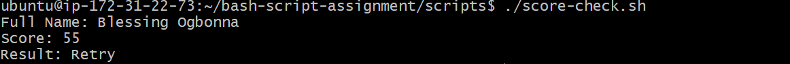

---

#### Screenshot 4 — Output showing `Result: Retry`

---

### Notes

Answer the following in your own words:

**1. What is the purpose of if-else in Bash?**

if-else allows a Bash script to make decisions based on a condition. If the condition is true, the script performs one action, and if the condition is false, it performs another action.

---

**2. What does `-ge` mean?**

-ge means greater than or equal to. In this script, it checks whether the score value is greater than or equal to 70 before deciding if the result is Pass or Retry.

---

**3. Why should conditions be tested with different values?**

Testing conditions with different values helps confirm that the script behaves correctly in different situations. For example, testing with 85 and 55 helps verify that both the Pass and Retry outcomes work as expected.

---

**4. How can conditionals help in automation scripts?**

Conditionals help automation scripts make decisions automatically. For example, a script can check if a file exists, if a service is running, or if a resource has reached a certain limit, and then take the correct action based on the result.

---

# Task 8 — Functions: Final Bash Automation Script

## Goal

Create a final Bash script using functions to organize reusable code.

### Evidence

#### Screenshot 1 — Content of `final-automation.sh`

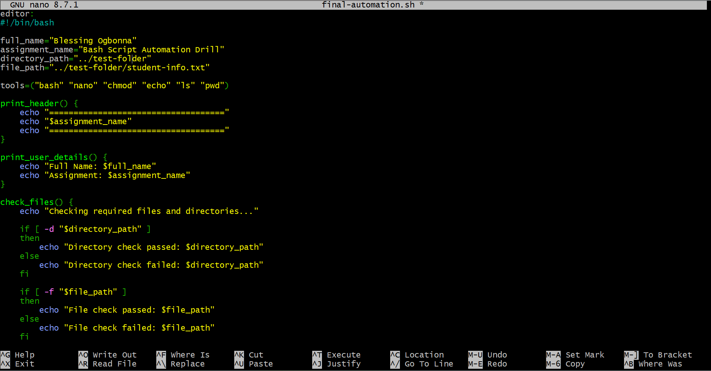

---

#### Screenshot 2 — Output of `./final-automation.sh`

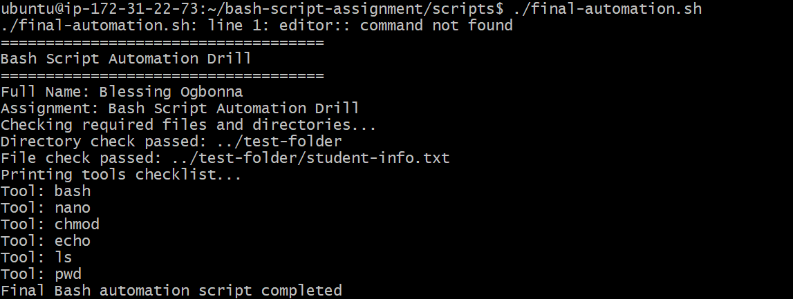

---

#### Screenshot 3 — Output of `ls -lah` showing all created scripts

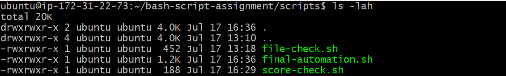

---

### Notes

Answer the following in your own words:

**1. What is a function in Bash?**

A function in Bash is a reusable block of commands grouped together to perform a specific task. Instead of writing the same commands multiple times, we can create a function and call it whenever needed.
---

**2. Why are functions useful in scripts?**

Functions make scripts more organized, readable, and easier to maintain. They also make troubleshooting easier because each function handles a specific responsibility.

---

**3. Which functions did you create in this script?**

I created four functions:
print_header() — displays the assignment header.
print_user_details() — displays my full name and assignment information.
check_files() — verifies whether the required directory and file exist.
print_tools() — uses a loop to display the tools stored in the array.

---

**4. How does this final script combine variables, arrays, loops, conditionals, files, and functions?**

The final script combines different Bash concepts into one automation workflow.

It uses variables to store information like my name, assignment name, and file paths. It uses an array to store the list of tools and a loop to display them one by one. It uses conditionals to check whether required files and directories exist. Finally, it uses functions to organize each task into separate sections, making the script cleaner and easier to manage.

---

# LinkedIn Post (Required)

## Evidence

#### LinkedIn Post URL

Paste your LinkedIn post URL here:

<<<<<<< HEAD:week-03-linux-for-devops/assignment-05-bash-script-automation-drill-ops-checklist.md
`https://www.linkedin.com/posts/blessing-ogbonna_devops-linux-bashscripting-ugcPost-7483937184459399168-lg42/?utm_source=share&utm_medium=member_desktop&rcm=ACoAADqul0oBNU_YyB5vIlKM3BG37iBvIrL_-oI`
=======
`Add your URL here`
>>>>>>> upstream/main:week-03-linux-and-bash-for-devops/assignment-05-bash-script-automation-drill-ops-checklist.md

---

#### Screenshot — Published LinkedIn post

---

# Submission Instructions

- Add all required screenshots in your submission
- Full name must be visible in required screenshots
- All script files must be created and run successfully
- Required notes must be answered clearly for every task
- Do not expose sensitive information (keys, passwords, credentials)

---

# Completion Checklist

- [ ] Task 1: Environment setup verified, workspace created (Screenshots 1–2, Notes answered)
- [ ] Task 2: First script created, executed, permissions verified (Screenshots 1–3, Notes answered)
- [ ] Task 3: Variables script created and run (Screenshots 1–2, Notes answered)
- [ ] Task 4: Arrays and loops script created and run (Screenshots 1–2, Notes answered)
- [ ] Task 5: Counter loop script created and run (Screenshots 1–2, Notes answered)
- [ ] Task 6: File validation script created and run (Screenshots 1–3, Notes answered)
- [ ] Task 7: Pass/Retry conditional script tested with both values (Screenshots 1–4, Notes answered)
- [ ] Task 8: Final automation script created and run (Screenshots 1–3, Notes answered)
- [ ] All scripts run without errors
- [ ] Full Name visible in all required screenshots
- [ ] LinkedIn post published and URL submitted
- [ ] No sensitive data exposed

---

## 📌 About DMI & CloudAdvisory

DevOps Micro Internship (DMI) is a project-based DevOps program run by Pravin Mishra (The CloudAdvisory) focused on real-world execution, systems thinking, and career readiness.

It helps learners build strong DevOps foundations with hands-on experience.

---

## 📌 Resources

- 🌐 DMI Official Website: https://pravinmishra.com/dmi  
- 🎓 DevOps for Beginners (Udemy): https://www.udemy.com/course/devops-for-beginners-docker-k8s-cloud-cicd-4-projects/  
- 🎓 Agentic AI DevOps with Claude Code: https://www.udemy.com/course/ultimate-agentic-ai-devops-with-claude-code/  
- 🎓 DevOps with Claude Code: Terraform, EKS, ArgoCD & Helm: https://www.udemy.com/course/devops-with-claude-code-terraform-eks-argocd-helm/  
- ▶️ YouTube Playlist: https://www.youtube.com/playlist?list=PLFeSNDtI4Cho  
- 🔗 Pravin Mishra (LinkedIn): https://www.linkedin.com/in/pravin-mishra-aws-trainer/  
- 🏢 CloudAdvisory (LinkedIn): https://www.linkedin.com/company/thecloudadvisory/

---

*This submission is part of DevOps Micro Internship (DMI) Cohort 3 — Agentic AI Track.*