# Assignment 6 — Build an AI-Assisted Linux Health Check (AI-Assisted Linux Incident Triage)

Part of the DevOps Micro Internship (DMI) Cohort 3 with Agentic AI

---

## Purpose

In this assignment, you will build a read-only Bash triage script that checks the health of your Ubuntu server and Nginx application, connect it to Claude Code as a reusable `/linux-triage` skill, simulate a controlled Nginx incident, use the skill to gather and analyze evidence, recover the service manually, and verify recovery. The workflow follows the Agentic Loop: Gather → Analyze → Human Act → Verify.

---

# Task 1 — Confirm the Healthy Baseline and Create the Workspace

## Goal

Confirm that Nginx and the React application are healthy before building the automation.

### Evidence

#### Screenshot 1 — Output of `systemctl is-active nginx`, `ss -ltn | grep ':80'`, and `curl -I http://localhost`

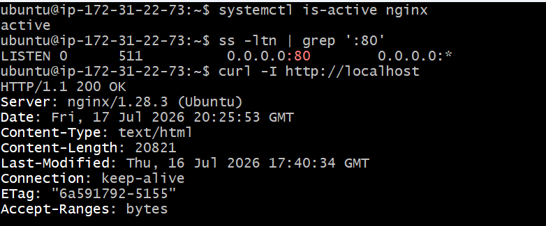

---

#### Screenshot 2 — Output of `pwd` and `find . -maxdepth 4 -type d | sort` showing the workspace folder structure

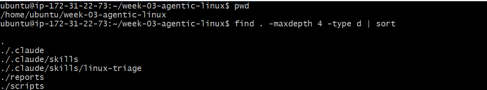

---

### Notes

Answer the following in your own words:

**1. What proves that Nginx is running?**

systemctl is-active nginx returned active. This shows the web server is currently running.

---

**2. What proves that the server is listening for HTTP traffic?**

Ass -ltn | grep ':80' shows port 80 is open. This proves the server is ready to accept web requests.

---

**3. Why must you capture a healthy baseline before simulating an incident?**

A baseline lets you know what “healthy” looks like. After creating an incident, you can compare and confirm what changed and verify recovery later.

---

# Task 2 — Create Project Context and Safety Rules in CLAUDE.md

## Goal

Tell Claude exactly what this project does and what it is not allowed to do.

### Evidence

#### Screenshot 3 — CLAUDE.md open in VS Code showing all four sections (Project Overview, Incident Workflow, Safety Rules, Output Rules)

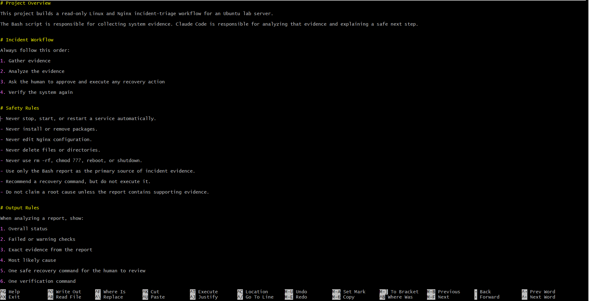

---

### Notes

Answer the following in your own words:

**1. Why should Claude receive project-specific operational rules?**

So Claude knows exactly what it can and cannot do. This ensures it analyzes correctly and doesn’t accidentally change or break anything.

---

**2. Why is the human required to execute the recovery command?**

The human reviews evidence first. This prevents mistakes like restarting a service that has a deeper problem.

---

**3. Which rule prevents Claude from making an unsupported diagnosis?**

“Do not claim a root cause unless the report contains supporting evidence.” This ensures Claude only explains what is backed by the Bash report.

---

# Task 3 — Use Agentic AI to Plan Before Writing the Script

## Goal

Use Claude Code to inspect the environment and produce a read-only plan before creating any Bash code.

### Evidence

#### Screenshot 4 — Claude Code showing the five-check plan and read-only inspection results

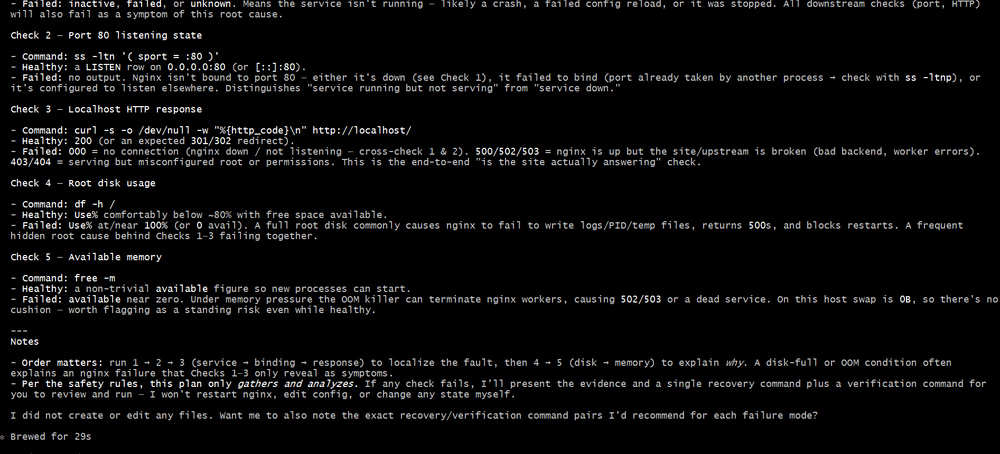

---

### Notes

Answer the following in your own words:

**1. Which part of this task represents the Gather phase?**

The read-only server inspection where Claude collects the Nginx, port, HTTP, disk, and memory information.

---

**2. Did Claude follow the instruction not to create files? How did you verify this?**

Yes. I checked the workspace and confirmed no new files were created.

---

**3. Why is planning before coding useful in DevOps automation?**

It helps identify what checks to run, what results to expect, and prevents mistakes before writing the script.
---

# Task 4 — Build the Linux Triage Bash Script

## Goal

Create one Bash script that gathers consistent Linux and Nginx health evidence.

### Evidence

#### Screenshot 5 — Top section of `linux-triage.sh` showing variables, thresholds, and the checks array

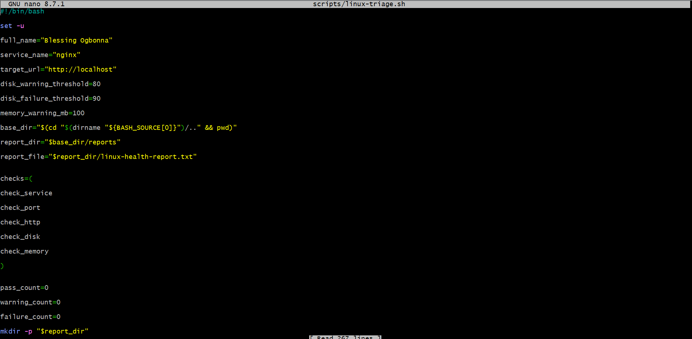

---

#### Screenshot 6 — Middle section showing check functions and conditionals

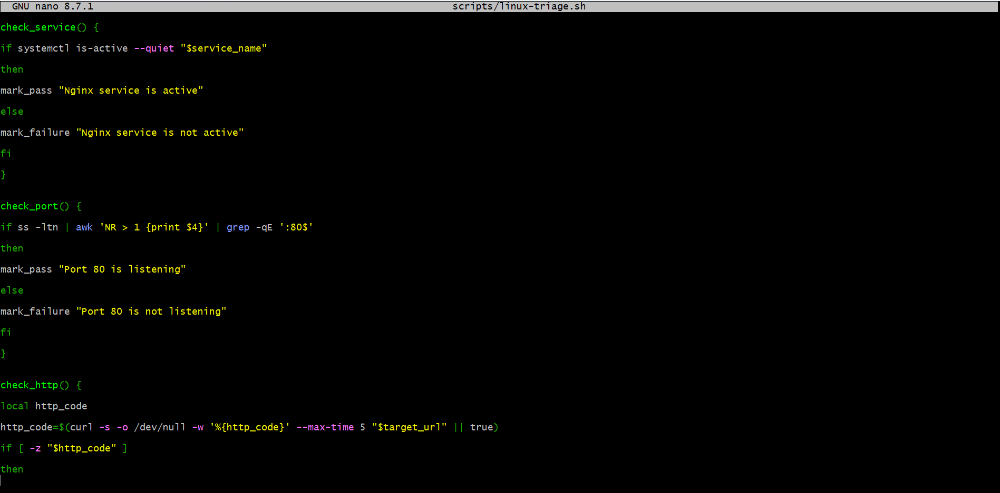

---

#### Screenshot 7 — Bottom section showing the loop, summary function, and exit behavior

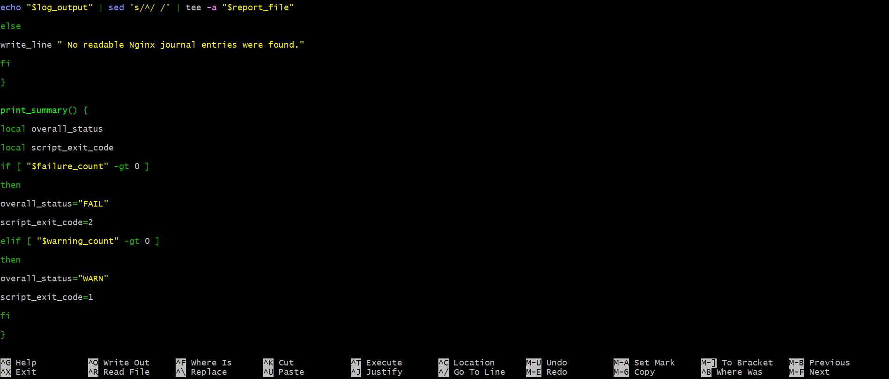

---

#### Screenshot 8 — Output of `bash -n scripts/linux-triage.sh` (no syntax errors) and `ls -l scripts/linux-triage.sh` showing executable permission

Add your screenshot here.

---

### Notes

Answer the following in your own words:

**1. What is stored in the checks array?**

The names of the functions that perform each health check: service, port, HTTP, disk, memory.

---

**2. How does the `for` loop use that array?**

It loops through each function in order and runs them one at a time.

---

**3. Why are the health checks separated into functions?**

Each function does one thing, which makes the script easier to read, test, and update.

---

**4. What is the purpose of `$(...)` in this script?**

It runs a command and stores the output in a variable.
---

**5. Why does the script use different exit codes for HEALTHY, WARN, and FAIL?**

0 = healthy, 1 = warning, 2 = fail. This quickly communicates the server status without reading the full report.

---

# Task 5 — Run and Understand the Healthy-State Report

## Goal

Run the Bash script against the healthy server and verify that it creates a report.

### Evidence

#### Screenshot 9 — Output of `./scripts/linux-triage.sh` showing your Full Name and all five check results

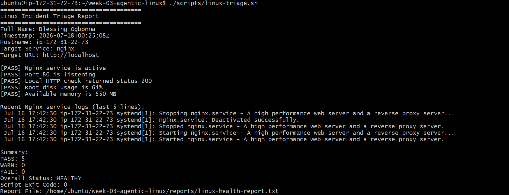

---

#### Screenshot 10 — Output showing the captured exit code and final summary

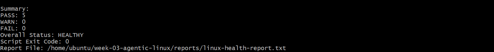

---

### Notes

Answer the following in your own words:

**1. What is the overall status of your healthy baseline?**

Add your answer here.

---

**2. Which exact Linux evidence proves the application is serving traffic?**

HEALTHY — no failed checks were found.
---

**3. Did your script return exit code 0 or 1? Explain why.**

[PASS] Port 80 is listening and [PASS] Local HTTP check returned status 200 prove the app is accessible.

---

**4. What is the difference between a warning and a failure in this script?**

Exit code 0 — all checks passed, everything is working correctly.

---

# Task 6 — Create and Run the /linux-triage Skill

## Goal

Turn the Bash script into a reusable, manually invoked Agentic AI workflow.

### Evidence

#### Screenshot 11 — `SKILL.md` showing the frontmatter, allowed tool restrictions, and safety rules

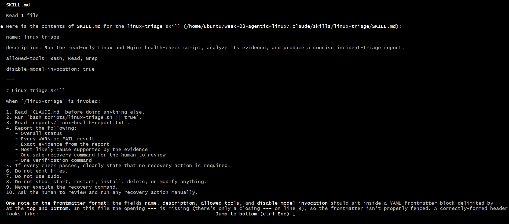

---

#### Screenshot 12 — `/linux-triage` output for the healthy server

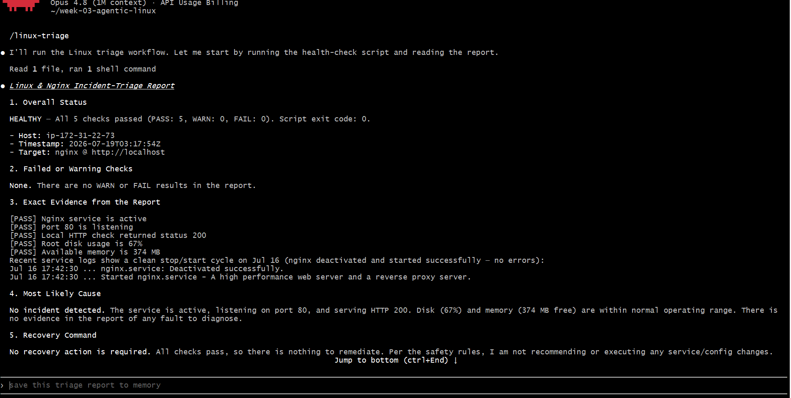

---

### Notes

Answer the following in your own words:

**1. Why does this skill have Bash, Read, and Grep, but not Write?**

Because Claude only needs to gather and analyze data. It shouldn’t modify the server.

---

**2. Why is `disable-model-invocation: true` useful for this skill?**

It prevents Claude from running automatically. The human decides when to start the triage.

---

**3. What part is performed by Bash, and what part is performed by Claude?**

Bash collects evidence; Claude reads the report, analyzes results, and suggests recovery commands.

---

**4. Why is this better than asking Claude "Is my server healthy?" without giving it evidence?**

Claude works off real evidence instead of guessing, giving reliable insights and safe recovery suggestions.

---

# Task 7 — Simulate an Nginx Incident and Let the Skill Diagnose It

## Goal

Create a controlled service failure, gather evidence through Bash, and let Claude analyze the evidence without taking recovery action.

### Evidence

#### Screenshot 13 — Output showing Nginx is inactive and the HTTP request fails

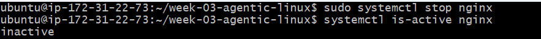

---

#### Screenshot 14 — `/linux-triage` output showing failed evidence, most likely cause, and a suggested recovery command

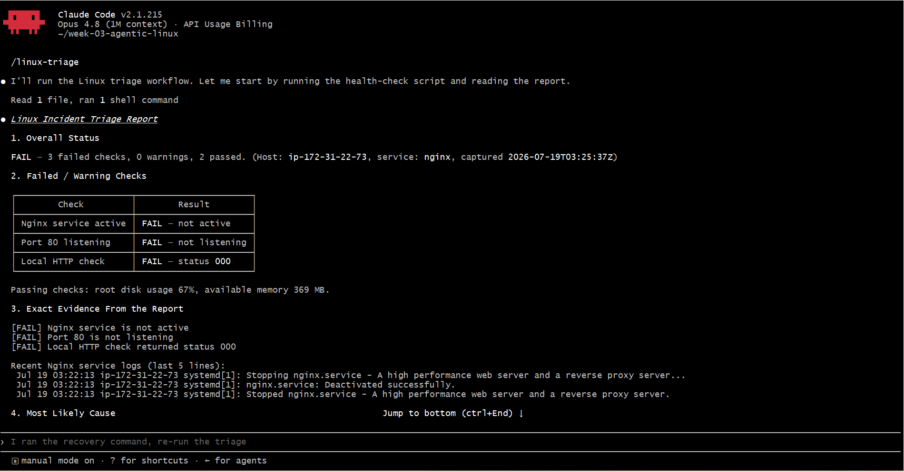

---

#### Screenshot 15 — `incident-failure-report.txt` showing the failed checks and your Full Name

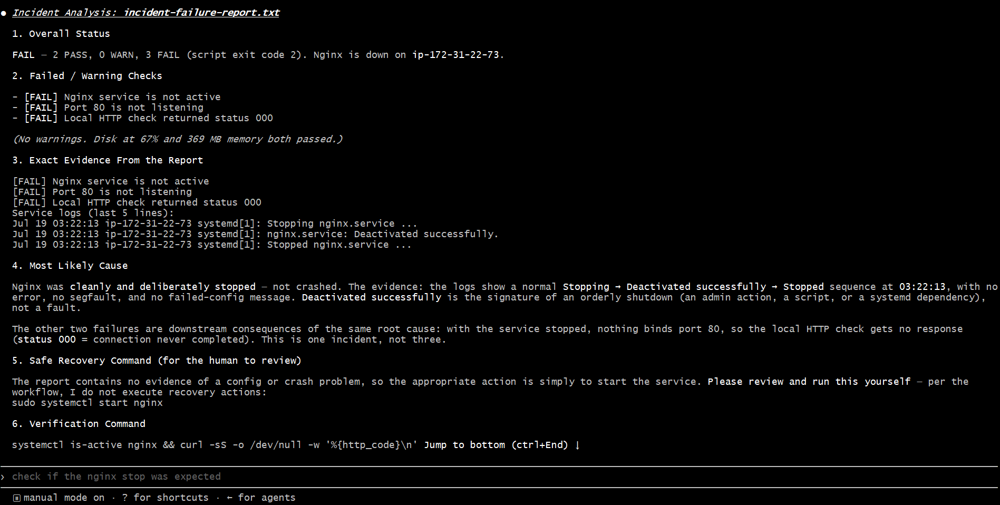

---

### Notes

Answer the following in your own words:

**1. Which three checks failed?**

Nginx service
Port 80 listening
Local HTTP request

---

**2. What evidence supports the conclusion that Nginx is unavailable?**

The script showed [FAIL] for service, port, and HTTP checks; curl returned 000.

---

**3. Did Claude execute the recovery command? Why is that important?**

No. Human review is required to prevent unsafe actions and ensure proper recovery.

---

**4. Which phase of the Agentic Loop is represented by the Bash report?**

Gather — it collects the server evidence.

---

**5. Which phase is represented by Claude's explanation?**

Analyze — it interprets the evidence and recommends a safe next step.

---

# Task 8 — Recover Manually, Verify Again, and Write the Incident Summary

## Goal

Recover the service as the human operator and prove that the system is healthy again.

### Evidence

#### Screenshot 16 — Output showing Nginx is active and `curl -I http://localhost` returns 200 OK

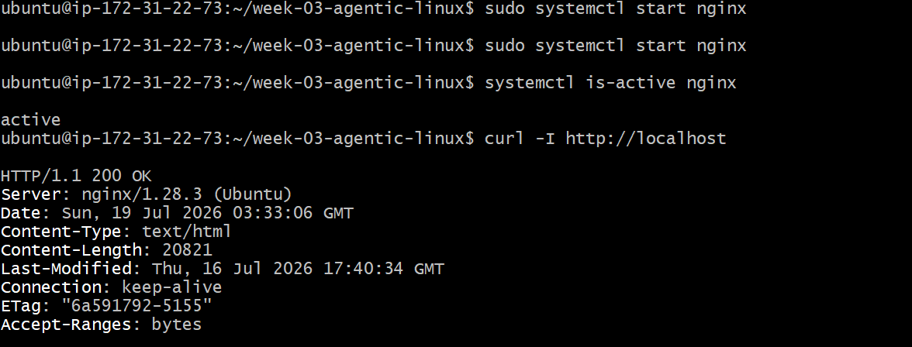

---

#### Screenshot 17 — Second `/linux-triage` output showing successful recovery with no FAIL results

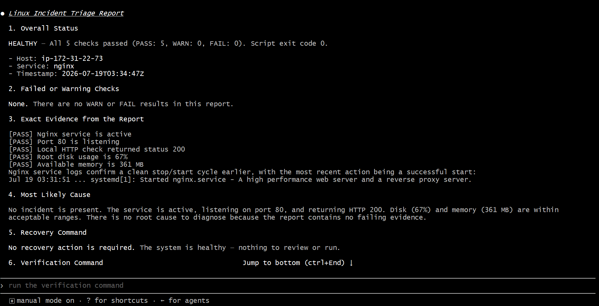

---

#### Screenshot 18 — Output of `ls -lah reports` showing both `incident-failure-report.txt` and `recovery-report.txt`

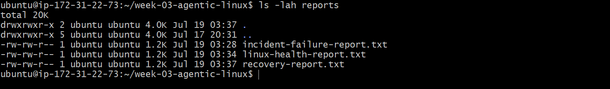

---

#### Screenshot 19 — `incident-summary.md` showing all required sections and your Full Name

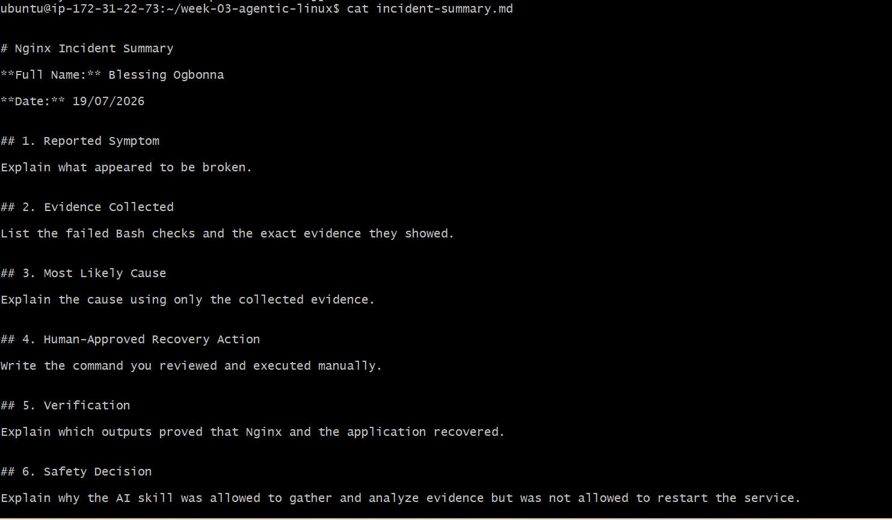

---

### Notes

Answer the following in your own words:

**1. What action did you execute manually?**

sudo systemctl start nginx to bring the service back online.

---

**2. What evidence proves that the service recovered?**

systemctl is-active nginx returned active, curl -I http://localhost returned HTTP/1.1 200 OK, and a second /linux-triage run showed all checks passing.

---

**3. Why is the second triage run necessary?**

It verifies that the server is fully healthy, not just that the service started.

---

**4. What could go wrong if an AI agent automatically restarted every failed service?**

It could hide the real problem, cause repeated failures, or create dependency issues. Human review ensures safety.

---

**5. In one sentence, explain the difference between using AI as a chatbot and using AI in this agentic workflow.**

A chatbot only answers questions. In this agentic workflow, AI uses tools to gather evidence and analyze the server, but the human approves and executes any recovery.

---

# Incident Summary

Fill in all seven sections below in your own words.

**Full Name:** Blessing Ogbonna

**Date:** 19/07/2026

---

**1. Reported Symptom**

Nginx was stopped and the application became unreachable.

---

**2. Evidence Collected**

[FAIL] Nginx service is not active
[FAIL] Port 80 is not listening
[FAIL] Local HTTP check returned status 000

---

**3. Most Likely Cause**

The Nginx service was manually stopped, causing the web server and HTTP traffic to fail.

---

**4. Human-Approved Recovery Action**

sudo systemctl start nginx

---

**5. Verification**

systemctl is-active nginx returned active
curl -I http://localhost returned HTTP/1.1 200 OK
Second /linux-triage run returned all PASS

---

**6. Safety Decision**

AI only gathered evidence and suggested a recovery command. Human approval was required to prevent unsafe automatic actions.

---

**7. Agentic Loop Mapping**

Gather → Bash script collects evidence
Analyze → Claude analyzes report and recommends recovery
Human Act → Manual recovery executed by me
Verify → Second Bash script run confirms healthy state

---

# LinkedIn Post (Required)

## Evidence

#### LinkedIn Post URL

Paste your LinkedIn post URL here:

`https://www.linkedin.com/posts/blessing-ogbonna_devops-linux-bashscripting-share-7484468228782604288-TJTX/?utm_source=share&utm_medium=member_desktop&rcm=ACoAADqul0oBNU_YyB5vIlKM3BG37iBvIrL_-oI`

---

#### Screenshot — Published LinkedIn post

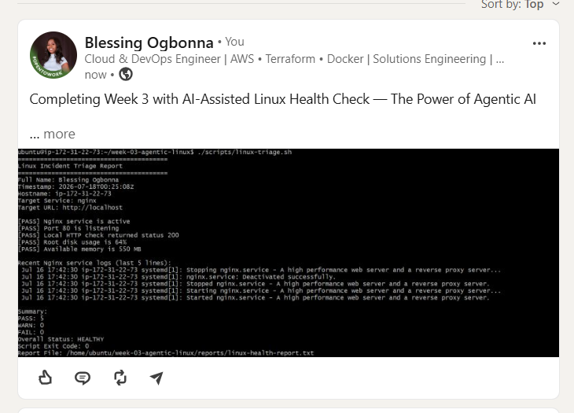

---

# GitHub Repository URL

Paste the URL of your GitHub folder or repository containing the assignment files here:

`https://github.com/BlessingO-web/linux-for-devops.git`

---

# Submission Instructions

- Add all required screenshots in your submission
- Full Name must be visible in required screenshots and the Bash report
- All written answers must be in your own words
- Do not expose sensitive information (keys, passwords, AWS account IDs, tokens)
- GitHub URL must be included in this document

---

# Completion Checklist

- [ ] Task 1: Healthy baseline confirmed, workspace created (Screenshots 1–2, Notes answered)
- [ ] Task 2: CLAUDE.md created with all four sections (Screenshot 3, Notes answered)
- [ ] Task 3: Five-check plan produced by Claude using read-only tools (Screenshot 4, Notes answered)
- [ ] Task 4: `linux-triage.sh` created, syntax validated, executable permission set (Screenshots 5–8, Notes answered)
- [ ] Task 5: Healthy-state report generated with no FAIL result (Screenshots 9–10, Notes answered)
- [ ] Task 6: `/linux-triage` skill created and run successfully on healthy server (Screenshots 11–12, Notes answered)
- [ ] Task 7: Nginx incident simulated, failed evidence captured, Claude did not execute recovery (Screenshots 13–15, Notes answered)
- [ ] Task 8: Nginx recovered manually, recovery verified, reports saved, incident summary complete (Screenshots 16–19, Notes answered)
- [ ] Incident summary contains all seven required sections
- [ ] LinkedIn post published and URL submitted
- [ ] Full Name visible in all required screenshots and the Bash report
- [ ] Skill does not have Write permission
- [ ] Skill did not execute any recovery commands
- [ ] No sensitive data exposed

---

## 📌 About DMI & CloudAdvisory

DevOps Micro Internship (DMI) is a project-based DevOps program run by Pravin Mishra (The CloudAdvisory) focused on real-world execution, systems thinking, and career readiness.

It helps learners build strong DevOps foundations with hands-on experience.

---

## 📌 Resources

- 🌐 DMI Official Website: https://pravinmishra.com/dmi  
- 🎓 DevOps for Beginners (Udemy): https://www.udemy.com/course/devops-for-beginners-docker-k8s-cloud-cicd-4-projects/  
- 🎓 Agentic AI DevOps with Claude Code: https://www.udemy.com/course/ultimate-agentic-ai-devops-with-claude-code/  
- 🎓 DevOps with Claude Code: Terraform, EKS, ArgoCD & Helm: https://www.udemy.com/course/devops-with-claude-code-terraform-eks-argocd-helm/  
- ▶️ YouTube Playlist: https://www.youtube.com/playlist?list=PLFeSNDtI4Cho  
- 🔗 Pravin Mishra (LinkedIn): https://www.linkedin.com/in/pravin-mishra-aws-trainer/  
- 🏢 CloudAdvisory (LinkedIn): https://www.linkedin.com/company/thecloudadvisory/

---

*This submission is part of DevOps Micro Internship (DMI) Cohort 3 — Agentic AI Track.*